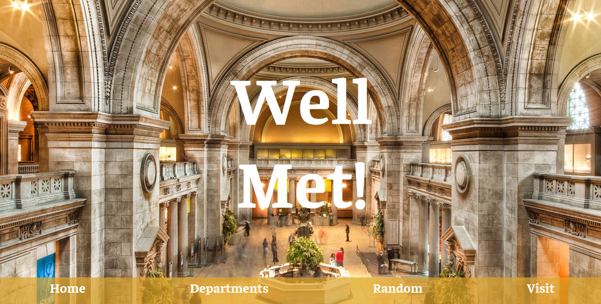
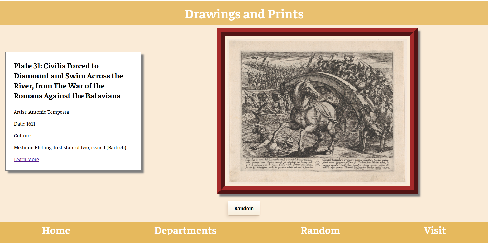

# Well Met!

Have you ever wanted to visit The Met but don't live in New York (or can't be bothered to go to the Upper East Side)? Welcome to Well Met! A virtual walkthrough of all public domain art available through The Met API.

[Visit Well Met!](https://well-met.netlify.app/)

## Description

This idea began from my interest in making all art as acessible as possible.

Users have the option to select their preferred department and browse through a comprehensive collection of items within the public domain.

Additionally, a randomized feature is available if the user preferres to see a random work of art across all departments.

Each art piece is accompanied by an informative tag including the title, the artist's name, the era or year of creation, and a link to The Met's dedicated page on the item in case the user is looking for further information. See pic below

## Help

Some departments have less items in the public domain than others. If a page takes longer than a few seconds to load a piece of art, it may simply be that no enough items in that department are avialable. Simply head back to the Departments page and choose a new selection, or click the Random Feature.

## Author

Grace Clower

LinkedIn: (https://www.linkedin.com/in/grace-clower/)

## Resources

https://metmuseum.github.io/
